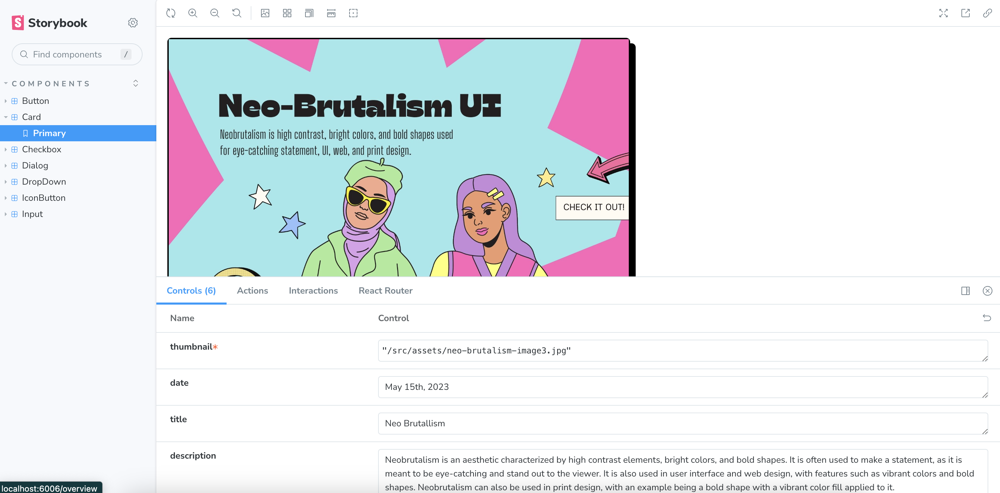

# Neo-Brutalism UI Library

[Neo-brutalism UI](https://neo-brutalism-ui-library.vercel.app/) is a collection of [React](https://react.dev/) and [Tailwind CSS-based](https://tailwindcss.com/) components that embody a design approach characterized by bold, high-contrast elements and vibrant colors. It offers a unique and eye-catching aesthetic for webpages.

## Demo screen recording

# Table of contents

- [Usage](#usage)
- [Configurations](#configurations)
- [Contributing](#contributing)
- [Technologies](#technologies)
- [License](#license)
- [Acknowledgement](#acknowledgement)

# Usage

## 1. For React users: Clone this repository and use Storybook

1. Clone the repository and run `yarn && yarn storybook` at the root of it.
2. All the components are listed on the left side of the Storybook, allowing you to quickly see how they work and check the component's accepted props.
3. Feel free to copy the code of the components to your project! All the components can be found in [./src/components folder](./src/components/).
4. If you also want to run the app, run `yarn run dev` at the root of the directory.

## 2. Easier way: Visit the Neo-Brutalism UI website

1. Visit [Neo-Brutalism UI website](https://neo-brutalism-ui-library.vercel.app/), and navigate to the [components page](https://neo-brutalism-ui-library.vercel.app/components/card).
2. Simply copy and paste the code snippet by clicking "Copy to clipboard" button.
3. To see it in action, access [the playground in StackBlitz](https://stackblitz.com/edit/tailwindcss-a14rd1?file=index.html)and paste your code there. [Demo screen recording](#demo-screen-recording) might help for you to figure out how it works.

## Note

Material Design Icons are used in the components. You can download the icons [here](https://www.figma.com/community/plugin/740272380439725040/Material-Design-Icons).

# Configurations

- This library is intended to be used with Tailwind CSS. If you plan to copy and paste the code snippet but haven't installed Tailwind CSS yet, please refer to [their installation instructions](https://tailwindcss.com/docs/installation).
- Note that the theme colors are override in `tailwind.config.js`. For more details, please [check the file](./tailwind.config.js).

  | Class          | Color code |                                                          |
  | -------------- | :--------: | -------------------------------------------------------: |
  | xxx-violet-200 | `#A8A6FF`  |  |
  | xxx-violet-300 | `#918efa`  |  |
  | xxx-violet-400 | `#807dfa`  |  |
  | xxx-pink-200   | `#FFA6F6`  |    |
  | xxx-pink-300   | `#fa8cef`  |    |
  | xxx-pink-400   | `#fa7fee`  |    |
  | xxx-red-200    | `#FF9F9F`  |     |
  | xxx-red-300    | `#fa7a7a`  |     |
  | xxx-red-400    | `#f76363`  |     |
  | xxx-orange-200 | `#FFC29F`  |  |
  | xxx-orange-300 | `#FF965B`  |  |
  | xxx-orange-400 | `#fa8543`  |  |
  | xxx-yellow-200 | `#FFF066`  |  |
  | xxx-yellow-300 | `#FFE500`  |  |
  | xxx-yellow-400 | `#FFE500`  |  |
  | xxx-lime-200   | `#B8FF9F`  |    |
  | xxx-lime-300   | `#9dfc7c`  |    |
  | xxx-lime-400   | `#7df752`  |    |
  | xxx-cyan-200   | `#A6FAFF`  |    |
  | xxx-cyan-300   | `#79F7FF`  |    |
  | xxx-cyan-400   | `#53f2fc`  |    |

# Contributing

Your contributions are always welcome! Make a PR if you have any suggestions!:smile:

# Technologies

# License

The MIT License

# Acknowledgement

This project is inspired by [Neo-Brutalism UI Kit](https://www.figma.com/community/file/1209478811951634271).
Huge thanks to [Muhamad Digdaya](https://www.figma.com/@muhamaddigdaya)!!:star_struck:
